# TMS Database Relation Diagram

```plantuml
@startuml TMS_Database_Schema

!define TABLE(name) class name << (T,#FFAAAA) >>
!define PK <<PK>>
!define FK <<FK>>

' ==================== CORE ENTITIES ====================
TABLE(User) {
    _id: ObjectId PK
    email: String
    password: String
    role: String
    status: String
    createdAt: Date
}

TABLE(Organization) {
    _id: ObjectId PK
    XCode: String (Unique)
    XName: String
    OrgType: String [MANUFACTURER|BRANCH|DEPOT|SHIPPER]
    Parent: ObjectId FK
    Path: [ObjectId]
    Address: String
    Latitude: Number
    Longitude: Number
    OpenTime: String (HH:mm)
    CloseTime: String (HH:mm)
    Country: String
    Currency: String
    TimeZone: String
    CreatedBy: ObjectId FK -> User
    Status: String [Active|Inactive]
    createdAt: Date
    updatedAt: Date
}

TABLE(Vehicle) {
    _id: ObjectId PK
    VehicleCode: String
    XName: String
    OrganizationID: ObjectId FK
    LicensePlate: String
    VehicleType: String [TRUCK|SEMI_TRUCK|TRAILER|BIKE]
    MaxWeight: Number
    MaxVolume: Number
    MaxCases: Number
    FixedCost: Number
    CostPerKm: Number
    AvgSpeedKmh: Number
    LoadingTime: Number
    UnloadingTimePerStop: Number
    EmploymentType: String [IN_HOUSE|OUTSOURCED]
    ServiceID: ObjectId FK -> Service (if OUTSOURCED)
    Status: String
    CreatedBy: ObjectId FK -> User
    createdAt: Date
    updatedAt: Date
}

TABLE(Driver) {
    _id: ObjectId PK
    DriverCode: String
    XName: String
    OrganizationID: ObjectId FK
    Phone: String
    Email: String
    LicenseNumber: String
    LicenseType: String
    LicenseExpiry: Date
    AllowedVehicleTypes: [String]
    LinkedUserID: ObjectId FK -> User (mobile app login)
    EmploymentType: String [IN_HOUSE|OUTSOURCED]
    ServiceID: ObjectId FK -> Service (if OUTSOURCED)
    Status: String [Active|Inactive]
    CreatedBy: ObjectId FK -> User
    createdAt: Date
    updatedAt: Date
}

' ==================== CUSTOMER & PRODUCT ====================
TABLE(Customer) {
    _id: ObjectId PK
    CustomerCode: String
    XName: String
    OrganizationID: ObjectId FK
    CustomerGroup: String
    Address: String
    Latitude: Number
    Longitude: Number
    OpenTime: String
    CloseTime: String
    ServiceTime: Number
    Phone: String
    Email: String
    Status: String
    CreatedBy: ObjectId FK -> User
    createdAt: Date
    updatedAt: Date
}

TABLE(ProductCategory) {
    _id: ObjectId PK
    CategoryCode: String
    XName: String
    OrganizationID: ObjectId FK
    Description: String
    Status: String
    CreatedBy: ObjectId FK -> User
    createdAt: Date
    updatedAt: Date
}

TABLE(Product) {
    _id: ObjectId PK
    ProductCode: String
    XName: String
    OrganizationID: ObjectId FK
    CategoryID: ObjectId FK
    Unit: String
    WeightPerCase: Number
    VolumePerCase: Number
    ItemsPerCase: Number
    Price: Number
    Status: String
    CreatedBy: ObjectId FK -> User
    createdAt: Date
    updatedAt: Date
}

' ==================== SALES & ORDERS ====================
TABLE(SalesOrder) {
    _id: ObjectId PK
    OrderCode: String (Unique with OrgID)
    OrganizationID: ObjectId FK
    CustomerCode: String
    OrderType: String [SALES]
    TypeWay: String [FIRST_WAY|SECOND_WAY]
    PickupOrder: Boolean
    SplittedOrder: Boolean
    OrderDate: Date
    TimeWindow: String
    ServiceTime: Number
    Items: [{ProductCode, NumberOfCases, ...}]
    TotalPrice: Number
    TotalServicePrice: Number
    OrderStatus: String
    FulfillmentStatus: String
    PlanningStatus: String [PENDING|PLANNED|LOCKED|FINALIZED]
    ApprovalStatus: String
    Source: String [WEB|MOBILE|IMPORT|INTEGRATION]
    createdAt: Date
    updatedAt: Date
}

' ==================== ROUTING & PLANNING ====================
TABLE(Service) {
    _id: ObjectId PK
    ServiceCode: String
    XName: String
    OrganizationID: ObjectId FK
    Carrier: String
    ServiceType: String [FTL|LTL|EXPRESS|LAST_MILE|REFRIGERATED|OTHER]
    FlatRate: Number
    PricePerKm: Number
    PricePerKg: Number
    PricePerCBM: Number
    MinCharge: Number
    FuelSurchargePercent: Number
    Status: String
    CreatedBy: ObjectId FK -> User
    createdAt: Date
    updatedAt: Date
}

TABLE(RoutePlan) {
    _id: ObjectId PK
    PlanCode: String (Unique)
    PlanName: String
    OrganizationID: ObjectId FK
    PlanDate: Date
    Shift: String [MORNING|AFTERNOON|FULL_DAY]
    Status: String [DRAFT|LOCKED|FINALIZED]
    Notes: String
    CreatedBy: ObjectId FK -> User
    createdAt: Date
    updatedAt: Date
}

TABLE(DeliveryRoute) {
    _id: ObjectId PK
    RoutePlanID: ObjectId FK
    OrganizationID: ObjectId FK
    VehicleID: ObjectId FK
    VehicleCode: String
    DriverID: ObjectId FK
    DriverCode: String
    ServiceID: ObjectId FK
    ServiceCode: String
    Shift: String
    IsOutsourced: Boolean
    Status: String [PLANNED|LOCKED|FINALIZED]
    Stops: [{StopIndex, CustomerCode, OrderIDs, ...}]
    TotalDistance: Number
    TotalWeight: Number
    TotalVolume: Number
    PlannedStartTime: String
    PlannedReturnTime: String
    EstimatedCost: Number
    Notes: String
    createdAt: Date
    updatedAt: Date
}

' ==================== TRIP & EXECUTION ====================
TABLE(Trip) {
    _id: ObjectId PK
    TripCode: String (Unique)
    OrganizationID: ObjectId FK
    RoutePlanID: ObjectId FK
    DeliveryRouteID: ObjectId FK
    VehicleID: ObjectId FK
    VehicleCode: String
    DriverID: ObjectId FK
    DriverUserID: ObjectId FK -> User
    DriverCode: String
    DriverName: String
    DriverPhone: String
    ServiceID: ObjectId FK
    ServiceCode: String
    ServiceName: String
    PlanDate: Date
    PlannedStartTime: String
    PlannedReturnTime: String
    Status: String [ASSIGNED|DRIVER_CONFIRMED|LOADING|IN_PROGRESS|RETURNING|COMPLETED|CANCELLED]
    IsOutsourced: Boolean
    Tasks: [{StopIndex, CustomerCode, OrderIDs, Status, ...}]
    ConfirmedAt: Date
    ConfirmPhotos: [String]
    LoadingStartedAt: Date
    LoadingPhotos: [String]
    StartedAt: Date
    StartPhotos: [String]
    StartOdometer: Number
    ReturnedAt: Date
    ReturnPhotos: [String]
    ReturnOdometer: Number
    CompletedAt: Date
    FinishPhotos: [String]
    CancelledAt: Date
    LastLatitude: Number
    LastLongitude: Number
    LastSpeed: Number
    LastGpsAt: Date
    TotalDistance: Number
    TotalWeight: Number
    TotalCODCollected: Number
    EstimatedCost: Number
    CurrentTaskIndex: Number
    Notes: String
    createdAt: Date
    updatedAt: Date
}

' ==================== MONITORING & INCIDENTS ====================
TABLE(GpsLog) {
    _id: ObjectId PK
    DriverID: ObjectId FK
    RouteID: ObjectId FK
    OrganizationID: ObjectId FK
    Latitude: Number
    Longitude: Number
    Speed: Number
    BatteryLevel: Number
    Timestamp: Date
    createdAt: Date
    updatedAt: Date
}

TABLE(TripIncident) {
    _id: ObjectId PK
    OrganizationID: ObjectId FK
    TripID: ObjectId FK
    TripCode: String
    DriverUserID: ObjectId FK -> User
    DriverName: String
    VehicleCode: String
    Type: String [BREAKDOWN|ACCIDENT|TRAFFIC|FUEL|CARGO_ISSUE|WEATHER|CUSTOMER|DEVIATION|OTHER]
    Severity: String [LOW|MEDIUM|HIGH|CRITICAL]
    Status: String [OPEN|ACKNOWLEDGED|RESOLVED|DISMISSED]
    Description: String
    Latitude: Number
    Longitude: Number
    Photos: [String]
    DeviationDistance: Number
    DeviationCount: Number
    ReportedAt: Date
    AcknowledgedAt: Date
    AcknowledgedBy: ObjectId FK -> User
    ResolvedAt: Date
    ResolvedBy: ObjectId FK -> User
    DispatcherNote: String
    createdAt: Date
    updatedAt: Date
}

' ==================== COMMUNICATION ====================
TABLE(ChatSession) {
    _id: ObjectId PK
    userId: ObjectId FK -> User
    OrganizationID: ObjectId FK
    handledBy: String [bot|human]
    status: String [OPEN|ANSWERED|CLOSED]
    subject: String
    messages: [{sender, body, userId, createdAt}]
    createdAt: Date
    updatedAt: Date
}

TABLE(DriverMessage) {
    _id: ObjectId PK
    OrganizationID: ObjectId FK
    TripID: ObjectId FK
    DriverID: ObjectId FK
    DriverUserID: ObjectId FK -> User
    SenderType: String [DISPATCHER|DRIVER]
    SenderUserID: ObjectId FK -> User
    SenderName: String
    Text: String
    ReadByDriverAt: Date
    ReadByDispatcherAt: Date
    createdAt: Date
    updatedAt: Date
}

' ==================== RELATIONSHIPS ====================
Organization ||--o{ User : "CreatedBy"
Organization ||--o{ Vehicle : "contains"
Organization ||--o{ Driver : "employs"
Organization ||--o{ Customer : "contains"
Organization ||--o{ Product : "contains"
Organization ||--o{ ProductCategory : "contains"
Organization ||--o{ SalesOrder : "contains"
Organization ||--o{ RoutePlan : "plans"
Organization ||--o{ DeliveryRoute : "optimizes"
Organization ||--o{ Service : "offers"
Organization ||--o{ Trip : "executes"
Organization ||--o{ GpsLog : "tracks"
Organization ||--o{ TripIncident : "monitors"
Organization ||--o{ ChatSession : "manages"
Organization ||--o{ DriverMessage : "exchanges"

Organization ||--o{ Organization : "Parent"

ProductCategory ||--o{ Product : "categorizes"
RoutePlan ||--o{ DeliveryRoute : "generates"
DeliveryRoute }o--|| Vehicle : "assigns"
DeliveryRoute }o--|| Driver : "assigns"
DeliveryRoute }o--|| Service : "uses (if 3PL)"
DeliveryRoute ||--o{ Trip : "creates"

Trip }o--|| RoutePlan : "from"
Trip }o--|| DeliveryRoute : "assigns"
Trip }o--|| Vehicle : "uses"
Trip }o--|| Driver : "performed by"
Trip }o--|| Service : "uses (if 3PL)"
Trip ||--o{ GpsLog : "generates"
Trip ||--o{ TripIncident : "reports"
Trip ||--o{ DriverMessage : "communicates"

Driver }o--o| User : "linked to (mobile app)"
Driver }o--o| Service : "outsourced to (if 3PL)"
Vehicle }o--o| Service : "outsourced to (if 3PL)"
Driver ||--o{ GpsLog : "records"

User ||--o{ ChatSession : "initiates"
User ||--o{ TripIncident : "handles"
User ||--o{ DriverMessage : "sends"

@enduml
```

## Database Statistics & Relationships Summary

### Core Entities:
- **Organization**: Root entity supporting multi-tenant & hierarchical organization
- **User**: System users with roles (including mobile-app login for drivers)
- **Vehicle**: Fleet vehicles with capacity constraints + EmploymentType (IN_HOUSE / OUTSOURCED 3PL)
- **Driver**: Drivers linked to User accounts + EmploymentType (IN_HOUSE / OUTSOURCED 3PL)
- **Customer**: Delivery destinations
- **Product & ProductCategory**: Inventory management

### Order & Planning (4 collections):
- **SalesOrder**: Sales orders with fulfillment tracking
- **RoutePlan**: Daily route planning
- **DeliveryRoute**: Optimized delivery routes with stops
- **Service**: 3PL services (FTL, LTL, EXPRESS, etc.)

### Trip Execution (4 collections):
- **Trip**: Main trip entity with status tracking & photographic evidence
- **GpsLog**: Real-time GPS tracking of vehicles
- **TripIncident**: Incident reporting (breakdown, accident, deviation, etc.)
- **DriverMessage**: Bidirectional communication between dispatcher & driver

### Support & Communication (2 collections):
- **ChatSession**: Customer support chat with bot/human handling
- **DriverMessage**: Trip-specific messaging

### Key Relationships:
1. **Multi-tenant scoping**: All entities scoped by `OrganizationID`
2. **Order → Trip mapping**: SalesOrder Items → Trip Tasks (denormalized)
3. **Planning hierarchy**: RoutePlan → DeliveryRoute → Trip
4. **Vehicle lifecycle**: Vehicle → DeliveryRoute → Trip → GpsLog
5. **Audit trail**: User tracking (CreatedBy, AcknowledgedBy, ResolvedBy)
6. **Photographic evidence**: Photos at Trip lifecycle stages & Incidents

### Key Indexes:
- `OrganizationID` for multi-tenant isolation
- `Status` fields for operational filtering
- `PlanDate`, `createdAt` for time-series queries
- Compound indexes for common query patterns (e.g., `[RoutePlanID, VehicleID]`)
